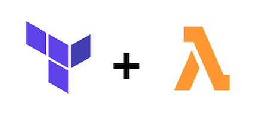
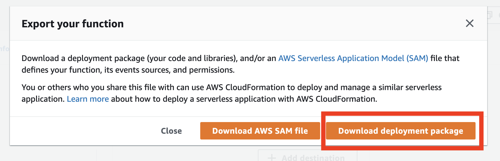

# Import an existing Lambda Function to Terraform
[](https://shields.io/)
## Prerequisites
* Download and install Terraform [here](https://www.terraform.io/downloads.html)
* Verify Installation:
``` bash
terraform --version
```
## Setup
Create a `main.tf` file in your working directory:
```terraform
provider "aws" {
  # assuming that you have your credentials setup in ~/.aws/credentials
  # otherwise use:
  #access_key = "ACCESS_KEY_HERE"
  #secret_key = "SECRET_KEY_HERE"
  region = "eu-west-1"
}

resource "aws_lambda_function" "terraform_lambda" {
  function_name = "terraform-managed-lambda"

  filename = "lambda.zip"

  handler = "lambda_function.lambda_handler"
  role    = "${aws_iam_role.iam_for_lambda.arn}"
  runtime = "python3.8"
}

resource "aws_iam_role" "iam_for_lambda" {
  name = "iam_for_lambda"

  assume_role_policy = "${file("${path.module}/iam/lambda-assume-role-policy.json")}"

}
```

Sign in to the AWS Console, head to your Lambda function and select Actions > Export Function > Download deployment package.



This will download your Lambda function as a zip file. Now rename the file to `lambda.zip`, add it to your working directory and run:

```bash
terraform init
```
and
```bash
terraform plan
```
## Import to Terraform
Run the following command in order to create your terraform file:
```bash
terraform import aws_lambda_function.terraform_lambda name-of-your-lambda
```
